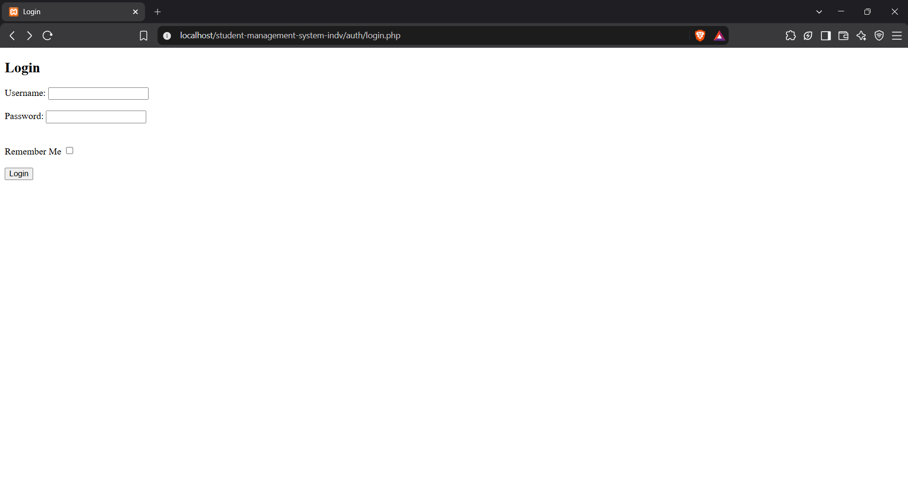
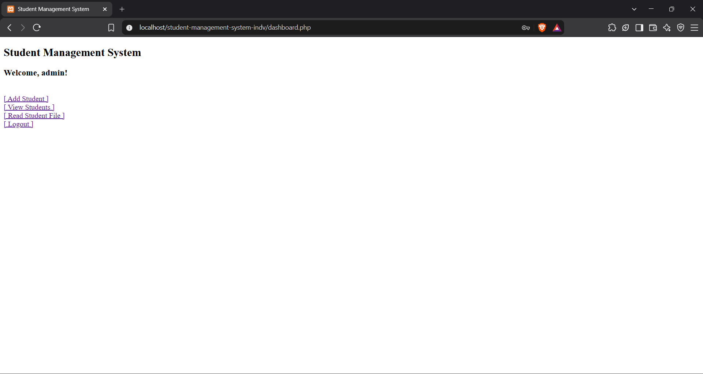
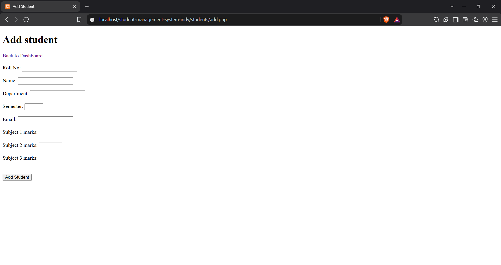
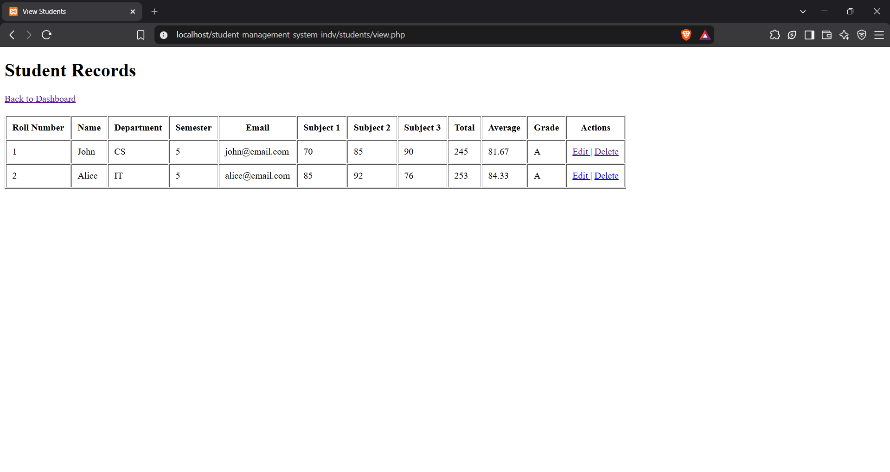
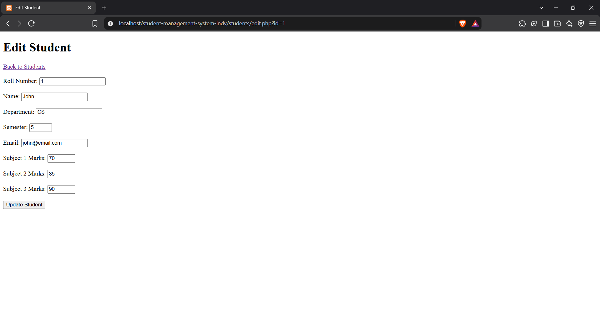
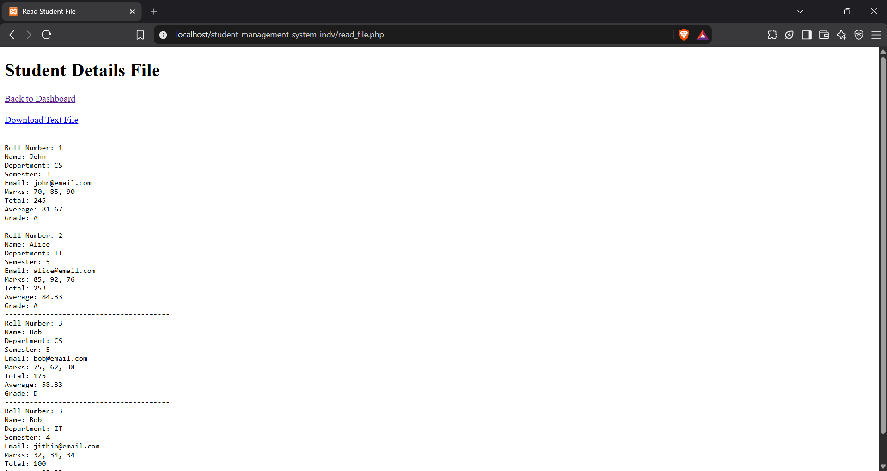

# Student Management System

A small PHP and MySQL application for managing student records through an administrator dashboard. Authenticated administrators can add, view, edit, and delete student records, while the application calculates each student's total marks, average, and grade. New records are also appended to a plain-text file that can be viewed or downloaded from the dashboard.

## Features

- Administrator login with PHP sessions.
- Optional username reminder using a 30-day cookie.
- Add student records with server-side validation.
- View all students in a tabular record list.
- Edit and delete existing records.
- Automatic calculation of total marks, average marks, and grade.
- Duplicate roll-number detection.
- Export of newly added student details to `files/students.txt`.
- In-browser viewing and downloading of the text-file records.
- Prepared SQL statements for login, inserts, and duplicate checks.
- HTML escaping when user-provided values are displayed.

## Screenshots

### Login



### Dashboard



### Add Student



### View Records



### Edit Student



### Read Student File



## Requirements

- PHP 7.4 or newer with the `mysqli` extension enabled.
- MySQL or MariaDB.
- Apache web server.
- XAMPP is recommended for local development on Windows.
- A browser with cookies enabled for session authentication and the optional username reminder.

## Installation With XAMPP

1. Install and start **Apache** and **MySQL** from the XAMPP Control Panel.
2. Copy or clone this project into the XAMPP web root, for example:

   ```text
   C:\xampp\htdocs\student-management-system-indv
   ```

3. Create a database named `student_management` in phpMyAdmin or the MySQL client.
4. Create the required tables with the SQL below.
5. Check the connection values in `config/database.php`. The default local XAMPP configuration expects the `root` user with an empty password.
6. Make sure PHP can write to the `files` directory. The application appends new records to `files/students.txt`.
7. Open the application at:

   ```text
   http://localhost/student-management-system-indv/
   ```

### Database Schema

Run this SQL after creating the database:

```sql
CREATE DATABASE IF NOT EXISTS student_management;
USE student_management;

CREATE TABLE admins (
	id INT UNSIGNED AUTO_INCREMENT PRIMARY KEY,
	username VARCHAR(100) NOT NULL UNIQUE,
	password VARCHAR(255) NOT NULL
);

CREATE TABLE students (
	id INT UNSIGNED AUTO_INCREMENT PRIMARY KEY,
	roll_no VARCHAR(50) NOT NULL UNIQUE,
	name VARCHAR(150) NOT NULL,
	department VARCHAR(150) NOT NULL,
	semester TINYINT UNSIGNED NOT NULL,
	email VARCHAR(255) NOT NULL,
	marks1 TINYINT UNSIGNED NOT NULL,
	marks2 TINYINT UNSIGNED NOT NULL,
	marks3 TINYINT UNSIGNED NOT NULL,
	CONSTRAINT students_semester_range CHECK (semester BETWEEN 1 AND 8),
	CONSTRAINT students_marks1_range CHECK (marks1 BETWEEN 0 AND 100),
	CONSTRAINT students_marks2_range CHECK (marks2 BETWEEN 0 AND 100),
	CONSTRAINT students_marks3_range CHECK (marks3 BETWEEN 0 AND 100)
);
```

The login code expects `admins.password` to contain a password hash generated by PHP's `password_hash()` function. For example, generate a hash with:

```bash
php -r "echo password_hash('change-this-password', PASSWORD_DEFAULT), PHP_EOL;"
```

Then insert the administrator using the generated hash:

```sql
INSERT INTO admins (username, password)
VALUES ('admin', 'PASTE_THE_GENERATED_HASH_HERE');
```

## How It Works

1. The root `index.php` redirects visitors to `auth/login.php`.
2. A successful login stores the administrator ID and username in the PHP session.
3. Protected pages check for the session before showing dashboard or student data.
4. The add form validates required fields, semester range, email format, marks range, and roll-number uniqueness.
5. A valid student is inserted into MySQL. The same record's calculated results are appended to `files/students.txt`.
6. The view page calculates and displays totals, averages, and grades from the stored marks.

### Grade Scale

| Average | Grade |
| --- | --- |
| 90-100 | S |
| 80-89.99 | A |
| 70-79.99 | B |
| 60-69.99 | C |
| 50-59.99 | D |
| Below 50 | F |

## Project Structure

```text
student-management-system-indv/
├── auth/
│   ├── login.php       # Administrator login
│   └── logout.php      # Ends the current session
├── config/
│   └── database.php    # MySQL connection settings
├── files/
│   └── students.txt   # Appended text export of added students
├── images/             # README screenshots
├── students/
│   ├── add.php         # Create a student record
│   ├── delete.php      # Delete a student record
│   ├── edit.php        # Update a student record
│   └── view.php        # List student records
├── dashboard.php       # Authenticated navigation page
├── index.php           # Entry-point redirect
├── read_file.php       # View or download the text export
└── style.css           # Shared styles for selected pages
```

## Routes

| Path | Purpose | Authentication |
| --- | --- | --- |
| `index.php` | Redirects to login | No |
| `auth/login.php` | Administrator login | No |
| `dashboard.php` | Main navigation | Required |
| `students/add.php` | Add a student | Required |
| `students/view.php` | View, edit, or delete records | Required |
| `students/edit.php?id=...` | Edit one record | Required |
| `students/delete.php?id=...` | Delete one record | Required |
| `read_file.php` | View or download `students.txt` | Required |
| `auth/logout.php` | End the session | Logged-in user |

## Notes

- The database and text file are two separate data stores. Editing or deleting a database record does not rewrite older entries already appended to `files/students.txt`.
- Update the default database credentials before deploying outside a local XAMPP environment.
- Use HTTPS and a proper secrets-management approach for production deployments.
- The application is intended as a simple educational CRUD project and should receive additional hardening before public deployment, including CSRF protection, stricter authorization, and production error handling.

## License

See [LICENSE](LICENSE) for license information.